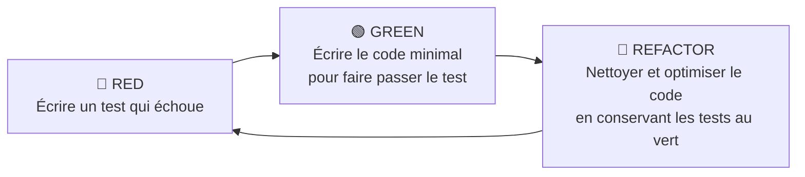
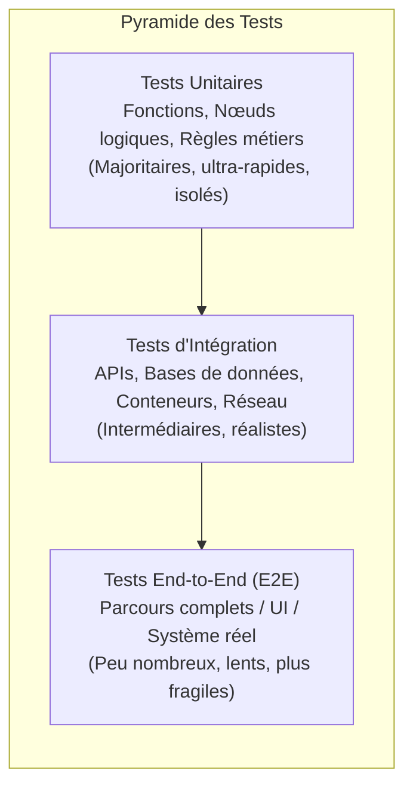

# Norme de Développement Basé sur les Tests (TDD & Bonnes Pratiques)

---

## 1. Introduction & Philosophie

Ce document définit les normes et bonnes pratiques d'ingénierie logicielle relatives au **Développement Piloté par les Tests** (*Test-Driven Development* - TDD) et aux stratégies d'assurance qualité applicables aux projets de développement, d'orchestration de flux (ex. n8n, API) et d'architectures agentiques.

### 1.1 Qu'est-ce que le TDD ?
Le TDD est une discipline de conception logicielle où **le test est rédigé avant le code de production**. Il ne s'agit pas seulement d'un mécanisme de validation, mais avant tout d'un guide d'architecture favorisant le découplage, la clarté des interfaces et la maintenabilité à long terme.

### 1.2 Le Cycle Fondamental : Red - Green - Refactor



1. **🔴 Phase RED** : Rédiger un test unitaire exprimant une exigence précise. Exécuter le test et vérifier qu'il échoue pour la bonne raison (ex: fonction inexistante, assertion non vérifiée).
2. **🟢 Phase GREEN** : Écrire le code de production le plus simple et direct permettant de satisfaire le test. Il est toléré de coder de manière brute pour valider l'hypothèse immédiatement.
3. **🔵 Phase REFACTOR** : Éliminer la duplication, clarifier les noms, factoriser et optimiser l'architecture tout en s'assurant que l'ensemble de la suite de tests reste au vert.

---

## 2. Les 3 Règles d'Or du TDD (Uncle Bob)

> [!IMPORTANT]
> Conformément aux principes de Robert C. Martin :
> 1. **Règle 1** : Vous n'avez pas le droit d'écrire du code de production à moins que ce ne soit pour faire passer un test unitaire qui a préalablement échoué.
> 2. **Règle 2** : Vous n'avez pas le droit d'écrire plus de test que nécessaire pour qu'il échoue (et une erreur de compilation/type est un échec).
> 3. **Règle 3** : Vous n'avez pas le droit d'écrire plus de code de production que le strict minimum nécessaire pour faire passer le test qui vient d'échouer.

---

## 3. La Pyramide des Tests

Pour garantir un retour rapide et un coût de maintenance maîtrisé, les tests doivent être répartis selon une pyramide équilibrée :



| Type de Test | Scope | Vitesse | Fréquence d'exécution | Dépendances externes |
| :--- | :--- | :--- | :--- | :--- |
| **Unitaire** | Fonction, méthode, classe isolée | < 5 ms par test | À chaque sauvegarde / pré-commit | Remplacées par des doublures (Mocks / Stubs) |
| **Intégration** | Dialogue entre 2+ composants (ex: n8n <-> Bionic, n8n <-> DB) | 100 ms - 2 s | Lors de la compilation locale & CI | Dépendances isolées (Docker, conteneurs éphémères) |
| **End-to-End (E2E)** | Scénario utilisateur de bout en bout | > 5 s | Pipeline CI / Déploiement staging | Environnement complet |

---

## 4. Structure & Qualité d'un Test

### 4.1 Le Pattern AAA (*Arrange - Act - Assert*)
Tout test unitaire doit être structuré en 3 blocs clairement distincts et sans ambiguïté :

```typescript
// Exemple en TypeScript / Vitest / Jest
describe('AgentPromptFormatter', () => {
  it('doit injecter le contexte utilisateur dans le template sans altérer les variables système', () => {
    // 1. ARRANGE (Préparation du contexte et des données de test)
    const template = "Système: Tu es un assistant.\nUtilisateur: {query}";
    const context = { query: "Quel est l'état du serveur ?" };
    const formatter = new AgentPromptFormatter();

    // 2. ACT (Exécution de l'action testée)
    const result = formatter.format(template, context);

    // 3. ASSERT (Vérification du résultat attendu)
    expect(result).toBe("Système: Tu es un assistant.\nUtilisateur: Quel est l'état du serveur ?");
  });
});
```

### 4.2 Les Critères **FIRST**
Chaque test doit scrupuleusement respecter les 5 critères suivants :

* **F - Fast** : Les suites de tests unitaires doivent s'exécuter en quelques secondes. Un test lent ne sera pas exécuté régulièrement par les développeurs.
* **I - Isolated / Independent** : Aucun test ne doit dépendre du résultat ou de l'ordre d'exécution d'un autre. Chaque test initialise et nettoie son propre état.
* **R - Repeatable** : Le test doit produire le même résultat sur n'importe quelle machine (Mac, Linux, CI) sans dépendre de l'heure système, du réseau public ou de données aléatoires non seedées.
* **S - Self-validating** : Le résultat du test est binaire : **Pass** ou **Fail**. Aucune interprétation manuelle de logs ne doit être requise.
* **T - Timely / Thorough** : Écrit juste avant le code de production, couvrant le chemin nominal (*Happy Path*), les cas aux limites (*Edge Cases*) et les cas d'erreur.

---

## 5. Gestion des Dépendances & Doublures de Test (*Test Doubles*)

Lorsqu'un composant dépend de services externes (APIs, base de données, inférence LLM, système de fichiers), utilisez des doublures appropriées :

1. **Dummy** : Objet passé en paramètre pour satisfaire la signature, mais jamais réellement utilisé.
2. **Stub** : Fournit des réponses préenregistrées aux appels effectués durant le test (ex: simuler une réponse HTTP 200 avec un JSON fixe).
3. **Spy** : Enregistre les informations sur la façon dont il a été appelé (nombre d'appels, arguments reçus).
4. **Mock** : Objet préprogrammé avec des attentes précises sur les appels qu'il doit recevoir, et dont la non-exécution provoque l'échec du test.
5. **Fake** : Implémentation fonctionnelle simplifiée, non adaptée à la production (ex: base de données SQLite en mémoire au lieu de PostgreSQL).

> [!WARNING]
> **Anti-Pattern : L'enfer des Mocks (*Mocking Hell*)**  
> Ne mockez pas ce que vous ne possédez pas et ne mockez pas chaque ligne de code interne. Mocker excessivement couple les tests à l'implémentation plutôt qu'au comportement, rendant les refactorisations douloureuses.

---

## 6. Spécificités : Tests pour n8n, Workflows & Systèmes IA / Agents

L'application des tests dans des architectures combinant n8n, conteneurs Docker et modèles de langage (LLM comme `qwen3.8`) impose des pratiques adaptées :

### 6.1 Environnement de Test & Conteneurisation (Docker Compose)
* **Orchestration de l'instance de test** : Le conteneur n8n peut être démarré via **Docker Compose** (`docker compose up -d`) afin de fournir un environnement isolé et prêt à l'emploi pour les tests d'intégration, les validations de webhooks et les scénarios E2E.
* **Reproductibilité Local & CI** : Docker Compose garantit la conformité des configurations (ports, volumes de persistance, passerelle `host.docker.internal` vers l'hôte) entre les postes de travail et les exécuteurs CI.

### 6.2 Tests des Composants n8n (Custom Nodes & Scripts)
* **Code Nodes (JavaScript / Python)** :
  * Isoler la logique métier dans des fonctions pures et testables avec Jest / Vitest / Pytest en dehors de l'interface n8n.
  * Tester les transformations de données (JSON in -> JSON out) avec des jeux de données d'exemples (*fixtures*).
* **Validation de Schéma (Contract Testing)** :
  * Valider les payloads des webhooks entrants et sortants avec **Zod** ou **JSON Schema**.

### 6.3 Tests des Interactions LLM & Agents
Par nature, les LLM sont non-déterministes et coûteux en temps de calcul :

1. **En Tests Unitaires & CI** :
   * **Toujours mocker l'API LLM / Bionic** avec des réponses déterministes.
   * Valider que le constructeur de prompt génère le bon format de message OpenAI (`system`, `user`, `tools`).
   * Valider que le parseur de *tool-calling* extrait correctement les arguments JSON.
2. **En Tests d'Intégration Évaluatifs (Evals)** :
   * Réserver les vrais appels à l'API Bionic (`host.docker.internal`) à des suites d'évaluation dédiées déclenchées manuellement ou lors des builds de nuit.
   * Utiliser des métriques d'évaluation (exactitude, présence de mots-clés, conformité JSON, score de similarité cosinus).

---

## 7. Anti-Patterns Majeurs à Proscrire

| Anti-Pattern | Description | Conséquence | Bonne Pratique |
| :--- | :--- | :--- | :--- |
| **The Liar (Le Menteur)** | Test qui réussit même quand le comportement sous-jacent est erroné (ex: assertions manquantes). | Faux sentiment de sécurité. | Toujours vérifier la phase 🔴 RED avant d'écrire le code. |
| **Testing the Implementation** | Tester les variables privées ou chaque appel de méthode interne. | Tests cassés au moindre refactoring alors que le résultat reste correct. | Tester les entrées/sorties et les comportements publics. |
| **The Slow Poke** | Tests unitaires effectuant de vraies requêtes réseau ou des accès disques non nécessaires. | Les développeurs désactivent les tests locaux. | Remplacer les I/O lentes par des doublures en mémoire. |
| **Flaky Tests** | Tests intermittents qui échouent aléatoirement (race conditions, dates, dépendances réseau). | Perte totale de confiance dans la suite de tests. | Éliminer tout aléa non contrôlé ; fixer les horloges (*time-mocking*). |
| **The Giant Test** | Un test de 200 lignes vérifiant 10 fonctionnalités différentes à la suite. | Diagnostic difficile en cas d'échec. | Un test = Un concept / Une règle métier. |

---

## 8. Intégration Continue (CI/CD) & Critères d'Acceptation

Pour qu'une fonctionnalité soit considérée comme prête (*Definition of Done*) :

- [ ] **100% de tests au vert** sur la branche locale avant tout commit.
- [ ] **Couverture de code raisonnable** : Objectif de **80% de couverture de branches** sur la logique métier critique (la couverture ne remplace pas la qualité des assertions).
- [ ] **Mutation Testing (optionnel recommandé)** : Utilisation ponctuelle de tests de mutation (ex: Stryker) pour valider la robustesse réelle des assertions.
- [ ] **Pipeline CI bloquant** : Aucun merge en branche principale sans validation complète de la suite de tests.
- [ ] **Documentation des régressions** : Tout bug identifié en production doit immédiatement donner lieu à la rédaction d'un test reproduisant le bug (phase 🔴) avant sa résolution.

---

> [!TIP]
> **Règle d'or de la maintenance** : Laissez la base de code plus propre après avoir fait passer vos tests que vous ne l'avez trouvée (*The Boy Scout Rule*).
