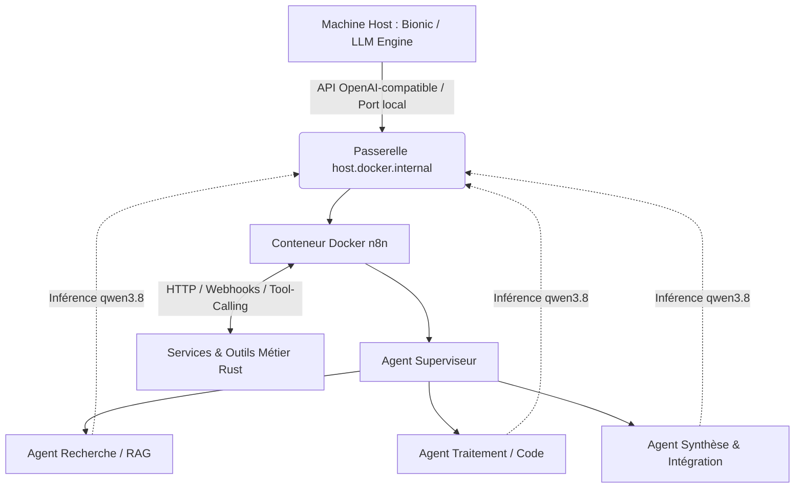
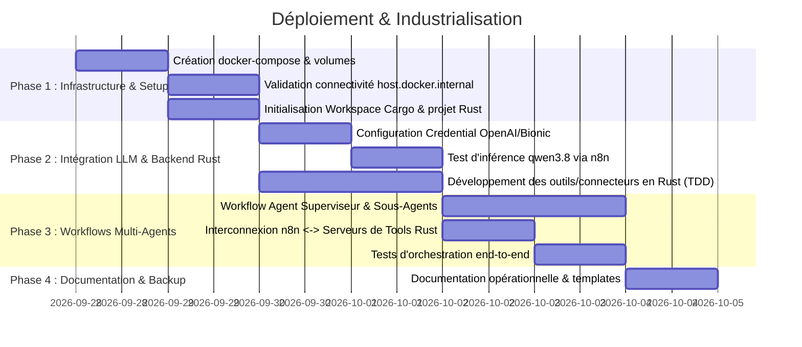

# Fiche Projet : Plateforme Multi-Agents n8n & Connectivité LLM Host (Bionic)

---

## 1. Résumé Exécutif

* **Nom du Projet** : Orchestration Multi-Agents n8n via Modèles Locaux Bionic
* **Langage & Stack de Développement** : **Rust** (services backend, microservices, connecteurs et outils d'agents)
* **Porteur / Environnement** : Environnement local Docker (macOS / Linux host)
* **Date de création** : 28 Septembre 2026
* **Statut** : Cadrage & Initialisation

### Synthèse
Ce projet vise à transformer l'usage des modèles d'intelligence artificielle locaux (actuellement opérés dans un mode monolithique au sein de Bionic, ex. modèle `qwen3.8` / Qwen 2.5/3) en déployant une instance **n8n** conteneurisée associée à des services et composants d'outillage développés en **Rust**. 

En reliant n8n aux modèles hébergés sur la machine hôte via une passerelle réseau (`host.docker.internal`) et aux services développés en **Rust**, n8n servira d'orchestrateur pour bâtir des **réseaux d'agents autonomes, spécialisés et collaboratifs** (Supervisor/Worker, Router, RAG, Tool-Calling), offrant une flexibilité, une visibilité, une sécurité mémoire et des performances optimales.

---

## 2. Contexte & Problématique

### 2.1 Contexte Actuel
* **Moteur d'inférence Bionic** : Bionic (BionicGPT / stack locale) exécute des modèles open-source performants sur la machine hôte (notamment les familles Qwen, Llama, etc.).
* **Limitation du mode monolithique** : L'accès direct via une interface monolithique limite les interactions à de simples échanges conversationnels ou des chaînes rigides prédéfinies.

### 2.2 Problématiques Identifiées
1. **Manque de modularité** : Impossibilité de composer dynamiquement plusieurs agents ayant des rôles distincts (ex. planificateur, chercheur, vérificateur, codeur).
2. **Couplage fort** : L'interface utilisateur, la logique métier et l'inférence sont regroupées dans un même silo.
3. **Absence d'outillage étendu** : Difficulté à connecter le LLM local à des systèmes tiers (bases de données, webhooks, APIs SaaS, systèmes de fichiers, MCP) sans développement lourd.

---

## 3. Objectifs du Projet

1. **Déploiement conteneur n8n** : Mettre en place un conteneur n8n sécurisé avec persistance des données et configuration réseau adéquate.
2. **Interconnexion Host <-> Docker** : Configurer la résolution DNS et le routage pour que n8n atteigne l'API OpenAI-compatible de Bionic sur la machine hôte.
3. **Connecteur Modèle n8n** : Configurer les nœuds *OpenAI Chat Model* (ou *Advanced AI*) de n8n pour cibler l'endpoint Bionic avec le modèle spécifié (ex: `qwen3.8`).
4. **Architecture Multi-Agents** : Concevoir les premiers workflows multi-agents exploitant le nœud *AI Agent* de n8n (mode routing, sous-agents, memory buffers, tools personnalisés).
5. **Développement en Rust** : Développer l'ensemble des modules applicatifs, services backend, microservices d'outillage (*Tool Calling*), connecteurs sur-mesure et scripts critiques en **Rust**, assurant une sécurité mémoire totale, des temps d'exécution optimaux et une forte capacité de traitement concurrent.
6. **Autonomie et extensibilité** : Permettre l'ajout d'outils tiers (APIs REST, scraping, webhooks, microservices Rust) manipulables par les agents sans impacter le moteur d'inférence.

---

## 4. Architecture Technique & Spécifications

### 4.1 Composants Système

| Composant | Rôle | Emplacement / Format |
| :--- | :--- | :--- |
| **Bionic Engine** | Inférence LLM locale (`qwen3.8`) | Machine Host (ports habituels Bionic : ex. `7880`, `8000` ou endpoint OpenAI `/v1`) |
| **Docker Engine** | Moteur de conteneurs | Machine Host |
| **n8n Container** | Orchestrateur de workflows & agents | Conteneur Docker (`n8nio/n8n:latest`) exposé sur le port `5678` |
| **Composants & Outils Rust** | Logique métier, serveurs de tools (tool-calling), connecteurs, microservices | Code source Rust (binaire natif / conteneur Docker dédié multi-stage) |
| **Volume n8n_data** | Persistance des workflows, credentials, exécutions | Volume Docker local |
| **Réseau Bridge / Extra Hosts** | Résolution de l'IP de l'hôte depuis le conteneur | `host.docker.internal:host-gateway` |

### 4.2 Configuration Réseau & Docker (Aperçu)

> [!IMPORTANT]
> Pour que le conteneur n8n puisse communiquer avec Bionic tournant sur l'hôte, la directive `extra_hosts` ou la variable `host.docker.internal` est indispensable.

Exemple de paramétrage cible dans `docker-compose.yml` :
* Image : `docker.n8n.io/n8nio/n8n:latest`
* Ports : `5678:5678`
* Extra Hosts : `host.docker.internal:host-gateway`
* Variables d'environnement clés :
  * `WEBHOOK_URL`
  * `GENERIC_TIMEZONE`
  * `N8N_ENFORCE_SETTINGS_FILE_PERMISSIONS=true`
  * `N8N_AI_ENABLED=true` (activé par défaut sur les versions récentes)

### 4.3 Paramètres de Connexion au Modèle Bionic dans n8n
Dans l'interface n8n, la connexion est configurée via le credential standard **OpenAI API** avec :
* **Base URL** : `http://host.docker.internal:<PORT_BIONIC>/v1`
* **API Key** : Clé API générée dans Bionic (ou token factice si Bionic n'exige pas d'authentification en local)
* **Model Name** : Nom exact déclaré dans Bionic (ex: `qwen3.8` ou modèle équivalent Qwen)

### 4.4 Spécifications du Développement en Rust

Le projet impose le langage **Rust** pour le développement de tous les composants applicatifs, services d'arrière-plan, connecteurs et outils personnalisés interfacés avec n8n :

* **Bénéfices & Justification** :
  * **Sécurité mémoire (*Memory Safety*) & Robustesse** : Garantie stricte à la compilation contre les pointeurs nuls, les corruptions mémoire et les *data races*, assurant une exécution résiliente 24/7.
  * **Performance & Efficience** : Vitesse d'exécution native, latence ultra-faible et empreinte RAM minimale, préservant la mémoire et le GPU de l'hôte pour l'inférence des modèles locaux (Bionic).
  * **Concurrence asynchrone** : Traitement massif et non-bloquant des requêtes webhooks, flux d'événements et interactions multi-agents.
* **Stack & Écosystème Rust Préconisé** :
  * **Édition** : Rust 2021 ou supérieure.
  * **Runtime asynchrone** : `tokio` (moteur I/O multi-threadé non bloquant).
  * **Serveur HTTP & API de Tools** : `axum` (exposition rapide d'endpoints REST et webhooks consommables par les agents n8n).
  * **Client HTTP** : `reqwest` (interfaçage HTTP vers n8n, Bionic et APIs externes).
  * **Sérialisation / Modélisation** : `serde` et `serde_json` avec typage strict pour la validation des contrats d'échange.
  * **Observabilité & Logs** : `tracing` et `tracing-subscriber`.
* **Qualité & Conformité TDD** :
  * Application intégrale de la norme TDD ([norme.md](file:///Users/julien.simand/n8n/norme.md)) via la commande standard `cargo test` (tests unitaires avec mocks et tests d'intégration dans `tests/`).
  * Analyse statique et respect strict du style : `cargo clippy -- -D warnings` et `cargo fmt --check`.

---

## 5. Stratégie Multi-Agents sur n8n

Plutôt qu'un traitement monolithique où un seul prompt tente de tout résoudre, n8n permet d'implémenter des topologies d'agents modernes :

### 5.1 Typologie des Réseaux d'Agents
1. **Modèle Superviseur & Spécialistes (Hierarchical Swarm)** :
   * Un *Agent Superviseur* reçoit la requête utilisateur, analyse l'intention et décompose le plan d'action.
   * Il délègue l'exécution à des sous-agents via des nœuds *Execute Sub-Workflow* ou *Tool Calling* :
     * *Agent RAG / Documentation* (recherche vectorielle, consultation de fiches).
     * *Agent Code / Analyse Technique* (génération de code, validation syntaxique).
     * *Agent Synthèse / Reporting* (formatage final selon le template utilisateur).
2. **Modèle Pipeline Séquentiel Réfléchi (Chained Reasoning)** :
   * Agent d'analyse -> Agent critique/validation -> Agent d'exécution -> Agent de restitution.
3. **Human-in-the-Loop** :
   * n8n permet d'insérer des nœuds d'approbation (via Webhook, Slack, Discord, email) avant qu'un agent n'effectue une action sensible.

---

## 6. Risques, Contraintes & Mitigations

| Risque | Impact | Solution / Mitigation |
| :--- | :--- | :--- |
| **Latence d'inférence concurrente** | Moyen à Élevé si plusieurs agents appellent le GPU hôte en même temps | Configurer des exécutions séquentielles ou une file d'attente (queue) dans n8n ; ajuster le paramètre `concurrency` dans Bionic/vLLM. |
| **Timeouts des requêtes HTTP n8n** | Moyen lors de générations de réponses longues | Augmenter le timeout HTTP dans les nœuds AI de n8n (ex: 120s à 300s). |
| **Résolution DNS Docker vers Host** | Élevé si la communication échoue au démarrage | Valider le ping et le `curl` vers `http://host.docker.internal:<PORT>` depuis l'intérieur du conteneur n8n. |
| **Consommation mémoire/VRAM** | Élevé si saturation de la machine | Utiliser des modèles quantifiés (ex. GGUF / AWQ / FP8) et allouer des quotas de contexte raisonnables (ex: 4k/8k tokens). |

---

## 7. Plan d'Action & Livrables

### Livrables Attendus
* [x] **Fiche Projet** : [projet.md](file:///Users/julien.simand/n8n/projet.md)
* [ ] **Codebase Rust** : Workspace Cargo (`Cargo.toml`, modules `src/`, suite de tests `tests/`) pour les microservices, connecteurs et outils d'agents (*Tool Calling*).
* [ ] **Fichier d'orchestration Docker** : `docker-compose.yml` préconfiguré avec `extra_hosts`, persistance et service applicatif Rust.
* [ ] **Fichier d'environnement** : `.env.example` détaillant les variables de ports et de tokens.
* [ ] **Workflow Démo n8n (JSON)** : Workflow exporté comprenant un agent n8n connecté à Bionic `qwen3.8` et aux outils Rust.
* [ ] **Guide d'exploitation** : Procédure de mise en route, vérification des logs et dépannage.

---

> [!TIP]
> **Prochaine étape recommandée** : Rédiger le fichier `docker-compose.yml` et initialiser le workspace Cargo (`Cargo.toml`) pour les composants Rust, puis tester immédiatement l'appel réseau vers l'API Bionic de votre machine hôte.
